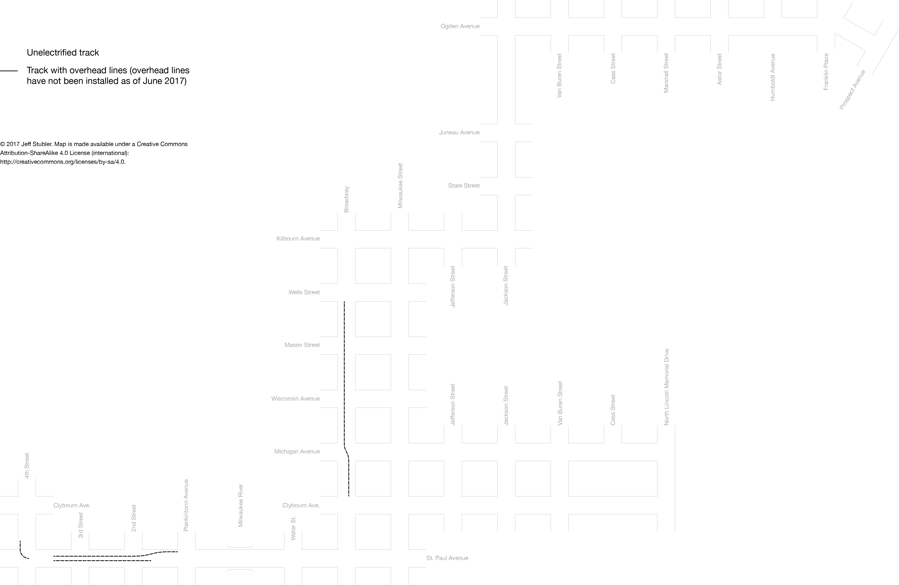

The Hop Track Map
=================

This is a map showing the track layout of The Hop (streetcar system in Milwaukee).
It shows the relative layout of tracks but is not to scale.

The system is currently under construction and the map will be periodically
updated to reflect new construction.
