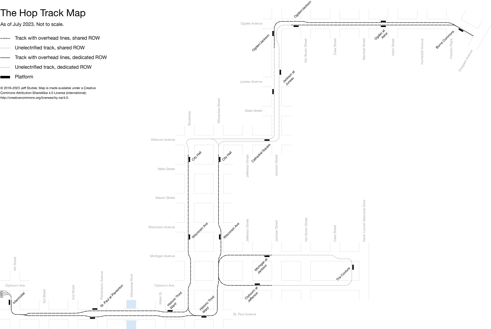

Milwaukee Streetcar Track Map
=============================

This is a map showing the track layout of the Milwaukee Streetcar.
It shows the relative layout of tracks but is not to scale.

The system is currently under construction and the map will be periodically
updated to reflect new construction. As construction of track work is mostly
complete and coming to a close for the 2017 construction season, future updates
will likely be less frequent.

Inclusion criteria
------------------
*  Tracks are added to map when construction activities show where tracks will
   be placed (e.g., when trenches are dug in roadways or when two trenches line
   up at an intersection)
*  Platforms are added when poured
*  Tracks are marked as electrified after overhead lines are installed

Contributions
-------------
I will take contributions and suggestions (MRs, but preferably issues). However,
to keep the chronological nature of the map, I will be rewriting history so that commits show the map over time.
